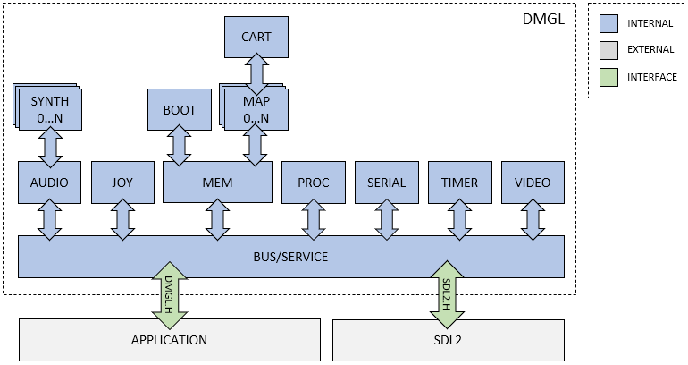

The goal of `DMGL` is to emulate the original Gameboy hardware with enough accuracy to run most common games, while being performant and natively compilable across multiple platforms.

## Project Architecture

`DMGL` contains a series of subsystems, each representing one component of the physical hardware in the Gameboy. The subsystems communicate with each other through, and are driven by, a central bus and service. The bus and service interface to the outside world for configuration and IO. The following diagram gives a high-level overview of how all the subsystems fit together:

## File layout

Subsystem source files can be found under the following directories:

|Directory          |Description                          |
|:------------------|:------------------------------------|
|`src/common`       |Common source files                  |
|`src/service`      |Service source files (SDL by default)|
|`src/system`       |Subsystem source files               |
|`src/system/mapper`|Mapper-specific source files         |

## Testing

Each subsystem has unit-tests, found under `test`

## Coding style

The source code generally conforms to the following coding standard:

### Enumerations

    /*!
     * @enum dmgl_xxx_e
     * @brief ...
     */
    typedef enum {
        DMGL_AAA = 0,   /*!< Doxygen comment */
        DMGL_BBB,       /*!< Doxygen comment */
        ...
    } dmgl_xxx_e;

### Structures

    /*!
     * @struct dmgl_xxx_t
     * @brief ...
     */
    typedef struct {
        dmgl_xxx_e val_0;   /*!< Doxygen comment */
        int val_1;          /*!< Doxygen comment */
        ...
    } dmgl_xxx_t;

### Functions

    #ifdef __cplusplus
    extern "C" {
    #endif /* __cplusplus */

    ...

    /*!
     * @brief ...
     * @param[in,out] arg_0 ...
     * @param[in] arg_1 ...
     * @return ...
     */
    int dmgl_xxx_yyy(dmgl_xxx_t *arg_0, dmgl_xxx_e arg_1, ...)
    {
        int result = DMGL_SUCCESS;

        if(arg_0 == NULL) {
            result = DMGL_FAILURE;
            goto exit;
        }

        ...

    exit:
        return result;
    }

    ...

    #ifdef __cplusplus
    }
    #endif /* __cplusplus */
